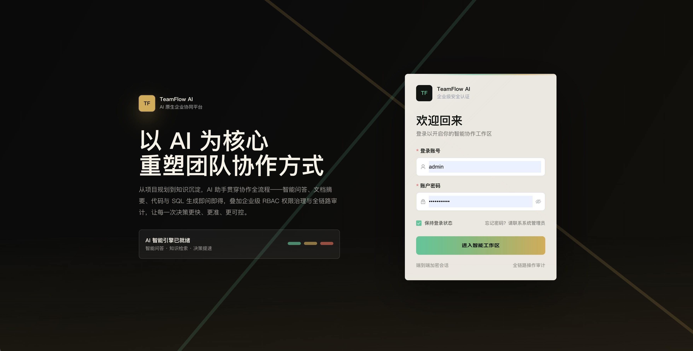
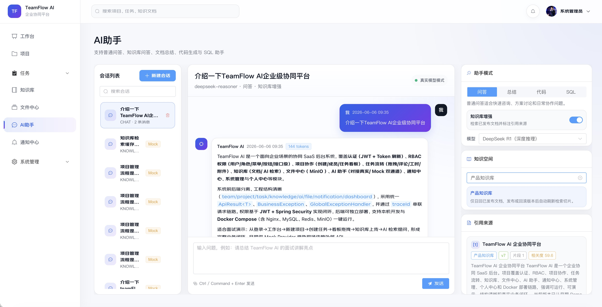

# TeamFlow AI 企业级智能协同平台

> AI-native enterprise collaboration platform with RBAC, knowledge RAG, workflow orchestration, real-time notification, file asset management, and cloud-native delivery.

[English](./README.en.md) | 中文

<table>
  <tr>
    <td width="50%"></td>
    <td width="50%"></td>
  </tr>
  
</table>

## 在线演示

- 演示地址：<http://81.69.248.152/login>
- 演示账号：`demo` / `demo123456`（只读演示账号）

## 项目定位

TeamFlow AI 是一个面向企业团队、研发组织和知识密集型业务场景的智能协同平台。它不是一个简单的后台模板，而是一套完整的 AI 原生企业应用骨架：从统一身份认证、动态权限、项目任务协同、知识库沉淀、文件资产管理，到 AI 助手、实时通知和 Docker/Nginx 部署链路，形成了可运行、可演示、可二次开发的全栈系统。

平台以现代 SaaS 后台的工程标准构建，强调清晰的领域模块、严格的权限边界、稳定的接口契约和可落地的业务闭环。它既可以作为全栈工程能力展示项目，也可以作为企业内部协同系统、AI 知识库、研发效能平台或低代码业务中台的起点。

## 核心亮点

- **AI 原生协同体验**：内置普通问答、知识库问答、文档总结、代码生成、SQL 助手等能力，支持 DeepSeek / OpenAI 兼容接口，并提供 Mock Provider 保障离线演示。
- **完整 RBAC 权限闭环**：JWT + Spring Security + 角色权限模型 + 动态菜单 + 按钮级权限 + 接口级权限，覆盖从前端路由到后端 API 的安全链路，并以 Redis 缓存用户权限，消除 JWT 过滤器在每次请求时的重复查询。
- **知识库 RAG 工程骨架**：支持 Markdown、TXT、PDF、DOCX 文件导入，文档发布后刷新 AI 检索切片，保留从知识沉淀到智能问答的完整流程。
- **项目与任务工作流**：项目、成员、标签、任务列表、看板拖拽、甘特图、评论、工时、附件、执行人协同，构成真实的团队交付闭环。
- **企业文件资产中心**：基于 MinIO 的文件上传、预览、下载、分享、业务归档和 500MB 大文件限制，适合沉淀组织级资料资产。
- **实时通知系统**：通知分页、未读角标、全部已读、WebSocket 实时推送，让平台具备事件驱动的协同反馈能力。
- **准生产级工程结构**：统一 `ApiResult<T>`、全局异常处理、TraceId、MyBatis-Plus、OpenAPI 文档、Docker Compose、Nginx 反向代理和健康检查。
- **开源友好的二次开发基础**：模块清晰、接口契约完整、初始化数据自动补齐，方便快速 fork、演示、扩展和私有化部署。

## 技术架构

```text
Browser
  |
  |  Vue 3 + TypeScript + Vite + Pinia + Element Plus
  v
Nginx / Vite Dev Proxy
  |
  |  REST API / WebSocket / SSE
  v
Spring Boot 3 Application
  |
  |-- Spring Security + JWT + RBAC
  |-- Project / Task / Knowledge / File / AI / Notification Modules
  |-- MyBatis-Plus Data Access
  |
  |-- MySQL 8      relational data
  |-- Redis        permission cache and runtime support
  |-- MinIO        object storage
  |-- AI Provider  DeepSeek / OpenAI compatible / Mock fallback
```

## 技术栈

| 层级 | 技术 |
| --- | --- |
| 前端 | Vue 3, TypeScript, Vite, Pinia, Vue Router, Element Plus, Axios, ECharts, MdEditorV3, SortableJS |
| 后端 | Java 17, Spring Boot 3, Spring Security, JWT, WebSocket, Validation, springdoc-openapi |
| 数据 | MySQL 8, Redis, MyBatis-Plus |
| 文件 | MinIO, Multipart Upload, 500MB upload limit |
| AI | OpenAI-compatible HTTP client, DeepSeek-compatible config, MockAIProvider fallback |
| 部署 | Docker, Docker Compose, Nginx, health checks, reverse proxy |

## 功能全景

### 认证与权限

- 账号密码登录、Token 刷新、统一 401 处理。
- 企业后台关闭自主注册，由管理员创建用户。
- 用户、角色、权限、菜单完整管理。
- 动态菜单、按钮权限、接口权限联动。
- 只读演示账号 `demo` 具备后端强制只读保护，所有写入请求直接拦截。

### 工作台

- 项目数、任务数、知识文档数、AI 消息数统计。
- 项目趋势、成员活跃度、AI 使用分布。
- 当前待办任务聚合。
- 从工作台一键进入项目创建链路。

### 项目协作

- 项目 CRUD、成员管理、标签管理。
- 新建项目置顶高亮，并给出添加成员、创建任务、查看详情等下一步操作。
- 项目统计、详情抽屉、成员角色支持。

### 任务流转

- 任务列表、任务看板、甘特图三视图。
- 看板拖拽更新状态。
- 负责人和多个执行人分离。
- 评论、工时、附件、标签完整协作能力。
- 任务变更可联动通知。

### 知识库与 RAG

- 知识空间、文档树、文档新增、编辑、删除。
- Markdown 编辑和预览。
- 发布、历史版本、回滚、收藏。
- 支持 md、txt、pdf、docx 上传导入。
- 发布后刷新 AI 检索切片，支撑知识库问答。

### 文件中心

- MinIO 文件上传、下载、预览、删除。
- 批量多选上传。
- 业务类型和业务 ID 归档。
- 文件分享能力。
- 500MB 上传限制和 Nginx 大文件代理配置。

### AI 助手

- 普通问答。
- 知识库问答。
- 文档总结。
- 代码生成。
- SQL 助手。
- DeepSeek / OpenAI 兼容接口。
- MockAIProvider 兜底，保证未配置 API Key 时依然可完整演示。

### 通知与个人中心

- 通知分页、搜索、仅看未读、全部已读、删除。
- WebSocket 实时推送。
- 未读角标。
- 头像上传、资料维护、密码修改、权限摘要、偏好设置。

## 项目结构

```text
.
├── backend
│   ├── src/main/java/com/teamflow/ai
│   │   ├── common              # API result, exception, security, trace, config
│   │   └── modules             # auth, user, system, project, task, knowledge, file, ai, notification
│   └── src/main/resources
│       ├── application.yml
│       └── db/schema.sql       # runtime schema and demo data bootstrap
├── frontend
│   └── src
│       ├── api                 # typed API clients
│       ├── components          # shared UI components
│       ├── layouts             # main shell
│       ├── router              # dynamic route sync
│       ├── stores              # Pinia stores
│       └── views               # feature pages
├── deploy/nginx                # Nginx reverse proxy configs
├── docker-compose.yml
├── README.md
└── README.en.md
```

## 快速开始

### 环境要求

- JDK 17+
- Maven 3.9+
- Node.js 20+
- MySQL 8
- Redis 7+
- MinIO

默认本机连接：

| 服务 | 地址 |
| --- | --- |
| MySQL | `127.0.0.1:3306/teamflow_ai` |
| Redis | `127.0.0.1:6379` |
| MinIO API | `http://127.0.0.1:9000` |
| MinIO Console | `http://127.0.0.1:9001` |

### 启动后端

```bash
cd backend
mvn spring-boot:run
```

后端以 JAR 方式运行、无热加载，修改 Java 代码后需重新打包并重启。本机开发推荐使用 `start-local.sh`，它会自动注入 AI 环境变量，避免重启时忘记带 Key 而退回 MockAIProvider：

```bash
# 先在 ~/.zshrc 中导出真实 Key（脚本本身不含 Key）
export AI_API_KEY=sk-你的真实key

cd backend
./start-local.sh --build   # 先 mvn package 再重启
./start-local.sh           # 用现有 jar 重启
```

后端默认地址：

```text
http://localhost:8080
```

Swagger:

```text
http://localhost:8080/swagger-ui.html
```

### 启动前端

```bash
cd frontend
npm install
npm run dev
```

前端默认地址：

```text
http://localhost:5173
```

如后端端口不是 `8080`：

```bash
VITE_PROXY_TARGET=http://127.0.0.1:18080 npm run dev
```

## 默认账号

应用启动时会由 `DemoDataInitializer` 自动补齐默认账号、角色、菜单、权限和演示数据。

```text
管理员账号：admin
管理员密码：admin123456

开发账号：dev
开发密码：dev123456

只读演示账号：demo
只读演示密码：demo123456
```

账号说明：

- `admin`：超级管理员，拥有完整系统管理权限。
- `dev`：普通开发角色，适合演示项目、任务、知识库、文件、AI、通知等业务模块。
- `demo`：只读演示角色，仅允许查看数据；后端会拦截所有新增、编辑、删除、上传、已读标记、AI 会话写入等非只读请求。

## AI 配置

后端使用 OpenAI 兼容 HTTP 接口，配置项位于 `teamflow.ai`，也可以通过环境变量覆盖：

```bash
export AI_PROVIDER=deepseek
export AI_BASE_URL=https://api.deepseek.com/v1
export AI_API_KEY=your-api-key
export AI_MODEL=deepseek-chat
```

说明：

- `AI_PROVIDER` 可填写 `deepseek`、`openai` 或其他兼容标识。
- `AI_BASE_URL` 需要指向兼容 `/chat/completions` 的服务地址。
- 未配置 `AI_API_KEY` 或上游调用失败时，系统自动回退到 `MockAIProvider`。
- 不要把真实 API Key 写入仓库。生产环境建议通过 `.env`、容器环境变量或云服务密钥管理注入。

## Docker Compose 部署

复制环境变量模板：

```bash
cp .env.example .env
```

根据实际环境填写 `.env` 中的 `JWT_SECRET`、`MYSQL_ROOT_PASSWORD`、`MINIO_ROOT_PASSWORD`、`AI_API_KEY` 等配置。

构建并启动：

```bash
docker compose up -d --build
```

带 AI 环境变量启动：

```bash
AI_PROVIDER=deepseek \
AI_BASE_URL=https://api.deepseek.com/v1 \
AI_API_KEY=your-api-key \
AI_MODEL=deepseek-chat \
docker compose up -d --build
```

生产入口：

```text
http://localhost
```

Compose 部署说明：

- 前端由 Nginx 对外暴露。
- `/api/` 反向代理到后端。
- `/ws/` 反向代理到 WebSocket 通知服务。
- `client_max_body_size 500m` 支持大文件上传。
- MySQL、Redis、MinIO、后端容器默认以内网方式协作，减少公网暴露面。
- MySQL、Redis 配置健康检查，后端等待核心依赖健康后启动。

## 验证命令

后端编译：

```bash
cd backend
mvn test
```

前端构建：

```bash
cd frontend
npm run build
```

端口检查：

```bash
lsof -nP -iTCP:8080 -sTCP:LISTEN
lsof -nP -iTCP:5173 -sTCP:LISTEN
```

接口检查：

```bash
curl http://localhost:8080/v3/api-docs
curl -I http://localhost:5173
```

Docker 检查：

```bash
docker compose config
docker compose up -d --build
docker compose ps
curl -I http://localhost
```

## 数据库初始化

运行时后端使用 `backend/src/main/resources/db/schema.sql` 自动初始化数据库。

## 为什么值得开源关注

TeamFlow AI 尝试把传统企业协同系统和 AI 能力放在同一个工程闭环里，而不是把 AI 当成孤立的聊天窗口。它把知识库、文件、任务、通知、权限、项目协作和 AI 助手放进统一的业务语境，使 AI 可以围绕企业知识和团队流程发挥作用。

如果你正在寻找一个可以研究、扩展或二次开发的企业级全栈项目，TeamFlow AI 提供了完整的模块边界、真实的业务流、现代化的前端体验和可部署的后端基础设施。

## 适合的使用场景

- 全栈工程师作品集和面试展示。
- 企业协同平台原型。
- AI 知识库和 RAG 应用脚手架。
- RBAC 权限系统学习和二次开发。
- Spring Boot 3 + Vue 3 企业后台最佳实践参考。
- 私有化部署的团队工作台基础版本。

## 贡献

欢迎通过 Issue 和 Pull Request 参与项目建设。建议贡献方向：

- 完善生产级向量检索能力。
- 增强 AI Agent 工作流。
- 增加多租户和组织架构模型。
- 增加审计日志和操作追踪。
- 增强端到端测试覆盖。
- 优化移动端响应式体验。

## License

本项目基于 [MIT License](./LICENSE) 开源。你可以自由地使用、复制、修改、合并、发布、分发、再许可及销售本软件，只需在所有副本或重要部分中保留版权声明与许可声明。

Copyright (c) 2026 wangguanfei
